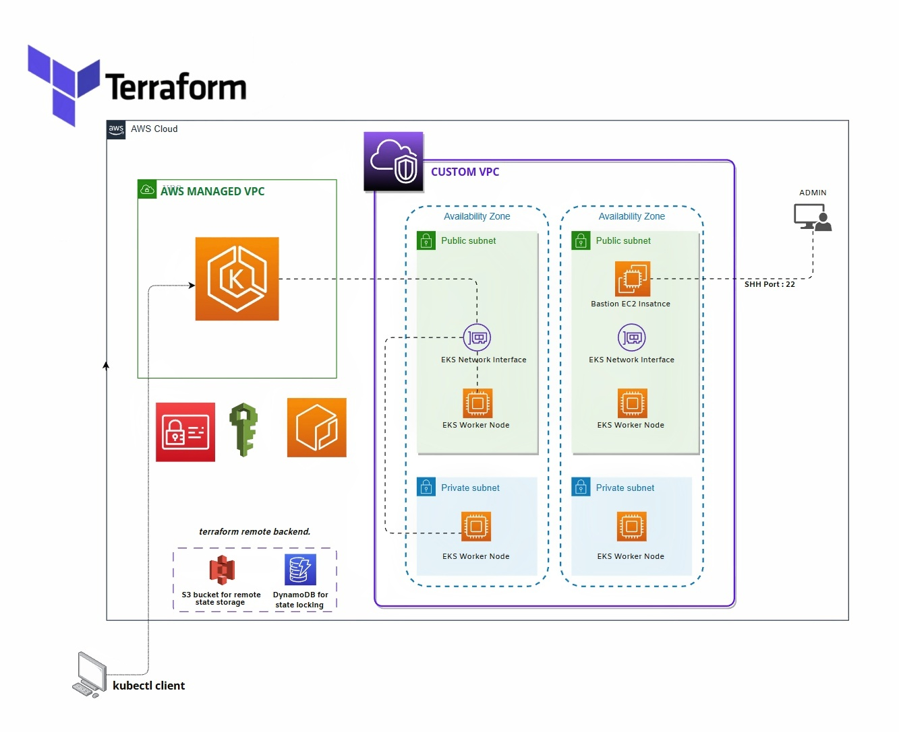

##### This Terraform Code creates a custom VPC with public and private subnets, an EC2 bastion host with a security group in the public subnet, an EKS cluster with a network interface in the public subnet, and two EKS node groups in the public and private subnets. IAM roles are created for the EKS cluster and node groups, and the necessary policies are attached to them. Additionally, a null resource with remote-exec is used to copy the pem key to the bastion host so that the admin can access the node group from the bastion host. An Elastic IP is also allocated to the bastion host to provide a static public IP address.



# DOCUMENTATION `Steps` and `Commands`:

## The Modules:

### 1- `VPC` 

The VPC is created using the `vpc` Terraform module, which sets up a custom VPC with two public subnets and two private subnets. the subnets are associated with a routing table that routes traffic to the Internet Gateway for the public subnets and the NAT Gateway for the private subnets.

### 2- `EC2 Bastion`

The EC2 bastion host is created using the bastion Terraform module, which uses the `ec2_instance` module to create the instance. The bastion host is placed in a security group that allows incoming SSH traffic from the user's IP address. An Elastic IP is allocated to the bastion host to provide a static public IP address.

Additionally, a `null resource` is used with `remote-exec` to copy the pem key to the bastion host so that the admin can access the node group from the bastion host.

- note:
 You must also have AWS credentials set up on your local machine follow the steps:
`from the console your aws accont go to EC2 Dashbords--> key pairs--> creat key pair named <eks-terraform-key> once it created it will Downlode the public ssh key to your local downlode folder then  you should create new folder name  <private-key> in the same path of you terraform fils then copy the public key (pem file) from downlode folder to the <private-key> folder so the terraform will see it.
(you can change the key and his folder name but u should change  him in the code )`
note:u can create the key with commands but the console way is simpler.


### 3- `EKS Cluster`

The EKS cluster is created using the `aws_eks_cluster` Terraform resource and includes a network interface in the public subnet. The IAM role for the EKS cluster is created using the iam Terraform module, and the necessary policies are attached to the role using the iam_policy_attachment resource.

#### EKS Node Groups

Two EKS node groups are created, one in the public subnet and one in the private subnet. The node groups are created using the `eks_node_group` Terraform resource, and the necessary IAM roles are created using the `aws_iam_role` role  and attached to the node groups using the `aws_iam_role_policy_attachment` resource.

## 1-Configure mypc with aws account
```
brew install awscli
cat .aws/credentials
vim .aws/credentials #then put awsaccount iam user credentials accses and secret keys
brew install terraform
brew install helm
brew install kubectl
terraform init
terraform plan 
terraform apply
```
## 2-Creating or updating a kubeconfig file for an Amazon EKS cluster (configure mypc with eks cluster)
```
aws eks update-kubeconfig --region <region code> --name <cluster name>
kubectl get svc
```
